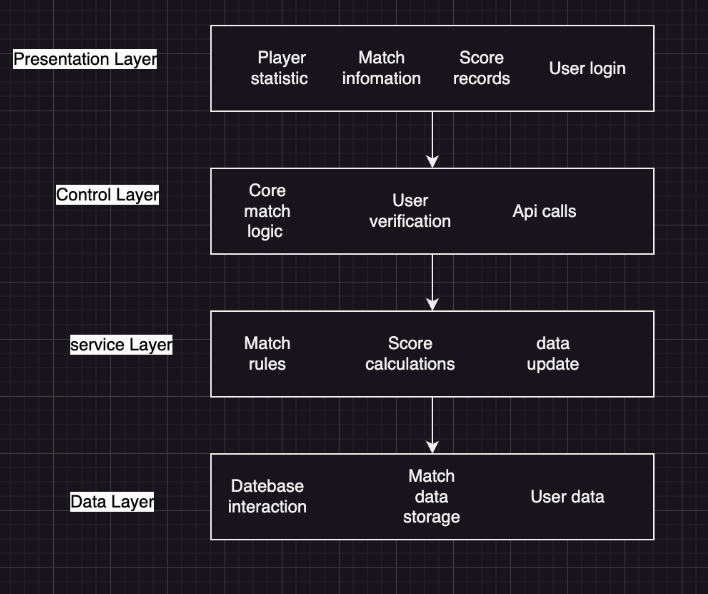
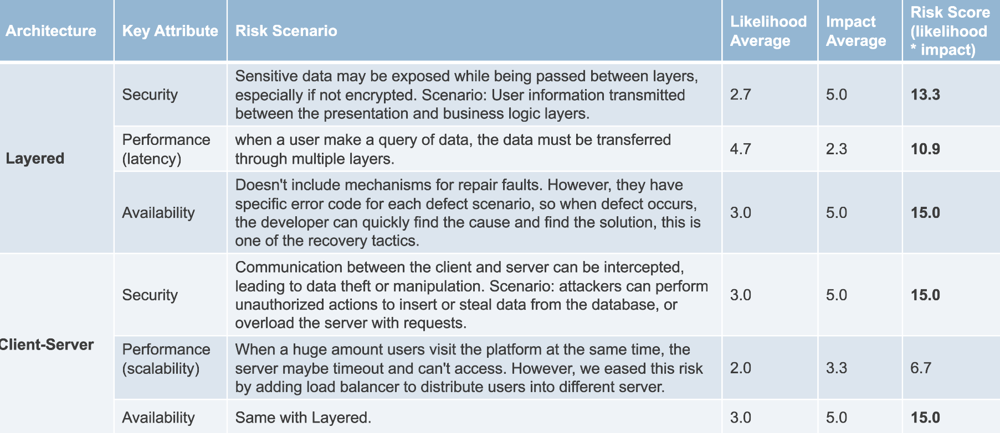
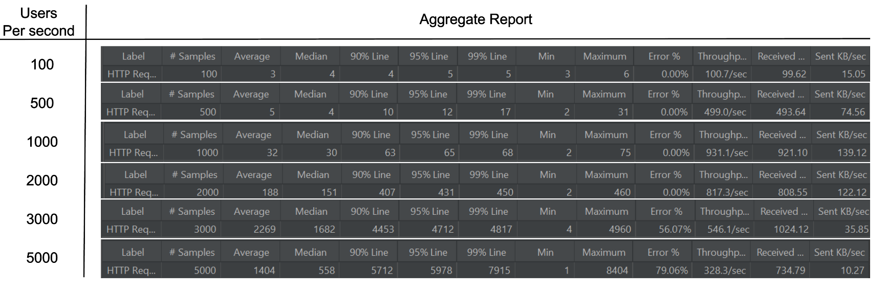

# CS7319 Software Architecture Design Group-8
### Project Overview

#### 1. Overview

Our vision for this project is to build a vibrant online community for badminton fans of all skill levels. We aim to create a platform that fosters connections, provides valuable resources, and promotes the growth of badminton as a sport.

Players can share their knowledge, passion, and experiences through this platform, making it easier for everyone to engage with and enjoy badminton.

Our ultimate goal is to deliver a seamless and enjoyable experience for all users, whether they are searching for playing partners, buying or selling sports equipment, or seeking to learn more about the game.

#### 2. Implementation 

Although we have two architectures, we use similar implementation tech.

- Program language: Java + JavaScript
- Framework: Springboot + SpringCloud(eruka) + React
- compiler/IDE:  IntelliJ IDEA/VsCode
- build tools: maven, Lombok

#### 3. Website functionality:

- Badminton-related information: tournaments, rules, etc
- Post second-hand sports equipment
- Find a courtmate: create/join a match
- Display nearby court information

#### 4. Option1 - Layered Layer Architecture

- Evaluation:
  - Pros
    - Clear Structure: Each layer has a defined role, making the code easier to organize and manage.​
    - Low Coupling: Changes in one layer don’t impact others, improving flexibility and maintainability.​
    - Better Testing: Each layer can be tested individually, making finding and fixing issues easier.​
    - Code Reusability: Layers like Data Access can be reused across different system parts.​
    - Scalability: Layers can be swapped or updated independently, supporting system growth.​
  - Cons
    - **Complexity for Small Projects**: Layered architecture can add unnecessary complexity to small projects.
    - **Performance Costs**: Communication between layers can slow the system, affecting performance.
    - **Less Flexibility for Fast Changes**: The structure can be limiting in projects needing rapid updates.
    - **Redundant Code**: Separate layers may create extra code, making simple tasks more complex.

#### 5. Option2 - Client-Server Architecture

- Evaluation
  - pros:
    - Client and server components can be improved separately, which is **easier to** **maintain** new features**.**
    - **RPC-based connectors,** standard data format(JSON) makes it easier for data delivery.
    - The server can handle multiple client **concurrently**, and the server can **scale up** to deal with the traffic when users increasing.
    - **Centralized data control** improve the **security** of the system, easily add data control method to improve the system's data protection.
  - cons:
    - The Centralized server may cause lower the **reliability** of the website, once the server crash down, users may not access the website.
    - Highly relying on the internet may lower the **performance** of the system when users are in a low data mode, causing the latency or the inaccessibility of the website.
    - The server may become the **bottleneck** when concurrent users increase.

#### 6. Final Selection

We finally choose the **Client-Server** architecture.

- **For functional perspective:**
  - The platform is built for communication and social networking, which naturally fits into the client-server model.

- **For non-functional perspective:**

  - **Scalability:** The client-server model can be easily scaled to handle growing user traffic in the future, by using load balancers, caching, and database replication.

  - **Maintenance**: With a centralized server, updates and bug fixes can be rolled out more efficiently without requiring changes on the client side.

#### 7. Risk Analysis

- LAE - Project Goals: providing a communication platform that is stable, efficient and easy-to-use.
  - 
- **Pressure Testing**
  - With the user number grows, the response time and the error percentages both increase in most situation.
  - Platform performs well when number of users is below 2000. Although the respond time increase, all requests are successful.
  - While when users number reaches 3000 per second, the platform has problems in both performance and availability.
  - 

