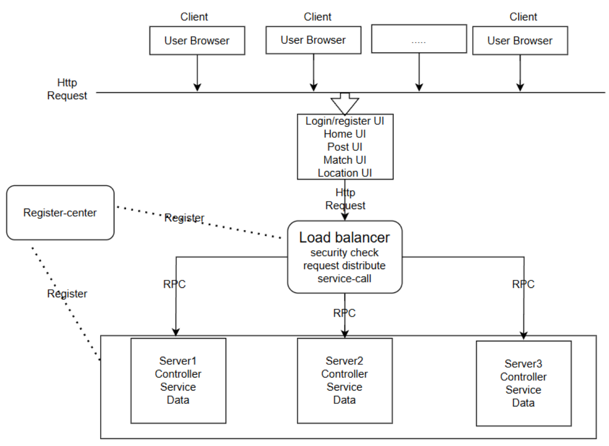
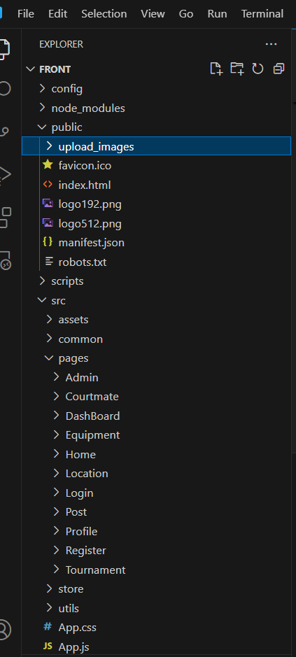
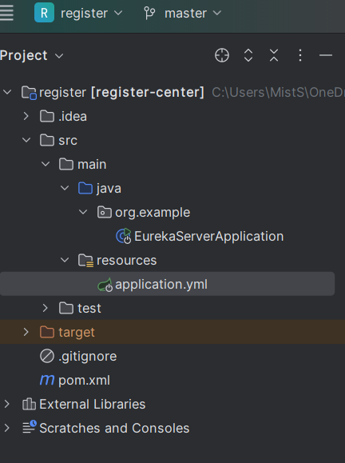
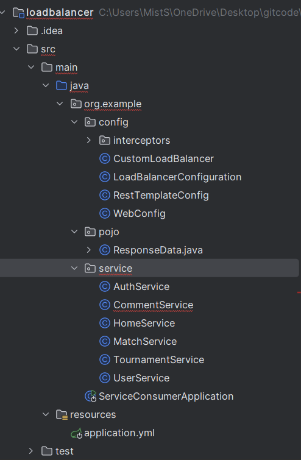
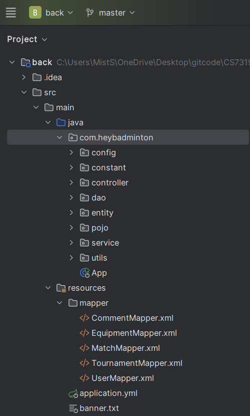
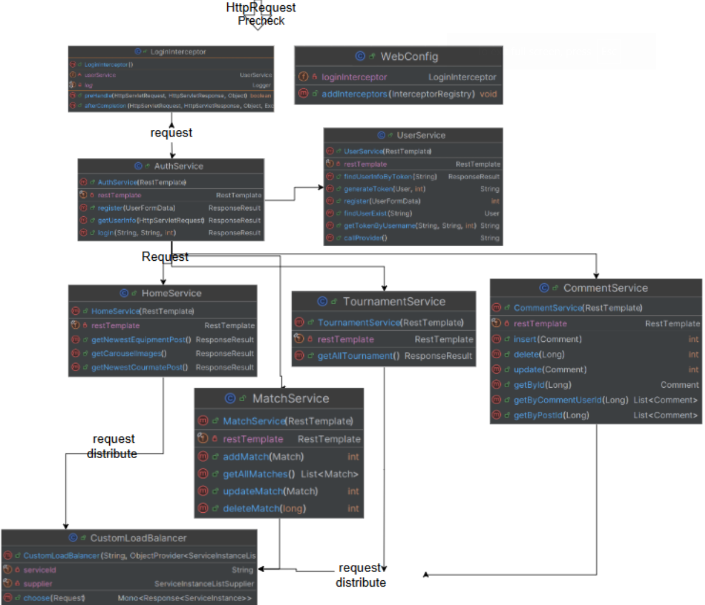

# Client Server Architecture

#### 1. Overview



In this architecture, we redesigned the classic layered architecture and applied the client-server architecture. Our improvements are mainly reflected in the following two aspects:

- Separation of front-end and back-end: We implemented the front-end and back-end independently to ensure that the front-end interface and back-end services can be independently developed and iterated, thereby improving development efficiency and system maintainability.

- New key components:
  - Registration Center: This component is responsible for recording the health status of the server cluster and load balancer to ensure the reliability and availability of the system.
  - Load Balancer: Used for traffic forwarding and pre-checking login information. All requests must carry the user's login information to improve the security of the system and the efficiency of request verification.

Through these improvements, we have achieved higher scalability and system performance optimization.

#### 2. Implementation and run

- Front: 

  ```c
  we use React to implement our front UI.
  How to Run:
  	1. install the nodejs
  	2. open the folder `front` and install library: 
  		npm install
      3. run website:
      	npm run start
  The website will open as localhost:3000
  ```

- Back:

  ```
  we use Java + Springboot2.7.2 + Mybatis + MySQL
  How to run:
  	1. install Java11 + Maven3.3.0
  	2. open the folder `back` via idea or vscode and run the project
  	3. the back will listen to: localhost:8001
  	
  Since we want to compose a back service cluster, we need run this project and listen to different ports:
  	localhost:8001,localhost:8002,localhost:8003
  ```

- Registration Center

  ```
  we use Java + Springboot2.7.2 + Springcloud-Eruka
  How to run:
  	1. install Java11 + Maven3.3.0
  	2. open the folder `back` via idea or vscode and run the project
  	3. the back will listen to: localhost:8761
  Each back service and the loadbalancer will register in registeration center.
  ```

- Load-balancer:

  ```
  we use Java + Springboot2.7.2 + Springcloud-load
  How to run:
  	1. install Java11 + Maven3.3.0
  	2. open the folder `back` via idea or vscode and run the project
  	3. the back will listen to: localhost:8000
  ```

Note: each project has a startup sequence: register -> back ->  load balancer -> front.

### 3. Main code structure

**Front UI :** 

**Registeration-Center:** 

**Load-balancer:** 


**Back Service:** 


#### 4. UML Class diagram

The class diagram mainly focus on the loadbalancer part, since we reuse most of functionalities in layer architecture.

The load balancer contains multiple service components, such as LoginInterceptor, AuthService... do the user login precheck,
Each service, For example, AuthService handles user authentication, and MatchService handles querying and updating match data., in this part it will use the resttemplate to do a rpc to our server cluster, our customer loadbalancer will distribute the rpc to different server.



